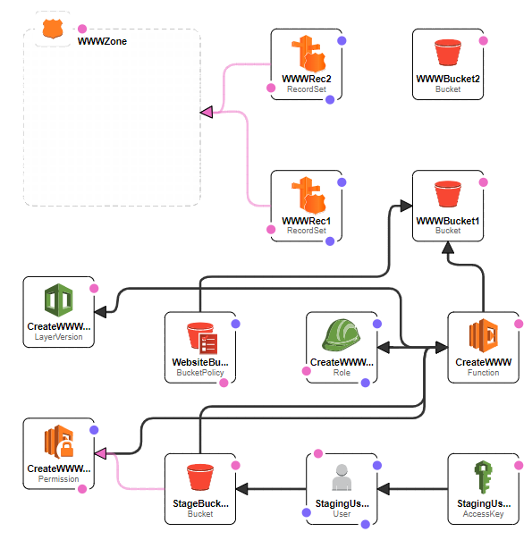

# AWS-Jekyll
(readme.md is WIP) SAM{instalacja, wymagania}

## Disclaimer
Current version works on Ruby 2.5.5 which is no longer supported by AWS. New version of the project will be available soon.

## About
AWS-Jekyll is a project that creates an infrastructure to make, host and manage static websites in a quick and easy way.

### Main components: 
- [Jekyll](https://jekyllrb.com) (version 4.1.1)
- [Amazon Web Services](https://aws.amazon.com)

## Setting up:
First, make sure you have an AWS Account :)  
After that, you need AWS [CLI](https://aws.amazon.com/cli/), [SAM](https://aws.amazon.com/serverless/sam/) and [Ruby](https://www.ruby-lang.org) (version 2.5) installed. 
If you are using AWS CLI for the first time, you have to link it to your AWS account (more about that [here](https://docs.aws.amazon.com/cli/latest/userguide/cli-chap-configure.html)).  
Make sure you have all the components installed:
```bash
$ aws --version

$ sam --version

$ ruby -v
```
Then, install [Ruby Bundler](https://bundler.io):
```bash
$ gem install bundler
```
When all the components are installed and ready, clone this repository:
```bash
$ git clone https://github.com/Kotzmik/AWS-Jekyll
$ cd AWS-Jekyll
```
Now its time to use AWS SAM commands:
```bash
$ sam build
```
Expected result:
```
Building function 'CreateWWW'
Running RubyBundlerBuilder:CopySource
Running RubyBundlerBuilder:RubyBundle
Running RubyBundlerBuilder:RubyBundleDeployment

Build Succeeded

Built Artifacts  : .aws-sam\build
Built Template   : .aws-sam\build\template.yaml

Commands you can use next
=========================
[*] Invoke Function: sam local invoke
[*] Deploy: sam deploy --guided
```
After that, you are ready to deploy the stack:
```bash
 sam deploy --guided
```
The --guided flag will help you fill in all the required parameters such as stack name, region and site name. After putting in the parameters, the terminal will show you all the resources, CloudFormation will be creating. Then, you will be asked to confirm this changeset (Y). When confirmed, toy will see all CF events in real time.

When the stack finishes deploying, you will see in the terminal two outputs: **StageBucket** and **WwwURL**. Copy the value of StageBucket to your clipboard.

You're almost done here :) The only thing left is uploading your website scaffolding to your s3 bucket:
```bash
 $ cd site
 $ aws s3 sync . s3://paste-StageBucket-ID-here
```

Now go back to the CF outputs, copy the WwwURL value and paste it into your browser. The site should be ready.

The only thing left is connecting your DNS to the S3 bucket through Route 53. If you bought the domain from AWS, your domain was automatically connected to the Hosted Zone. If that is not your case, [this article is for you](https://docs.aws.amazon.com/Route53/latest/DeveloperGuide/MigratingDNS.html). Remember that any changes with the DNS can take alot of time.

## Using it
Before you start creating your own website on this structure, you need to have a basic understanding of the Jekyll gem (considering you already understand HTML, CSS, Markdown, etc.). [This link](https://jekyllrb.com/docs/) contains whole jekyll documentation, which will not only help you make your own website, but also help you better understand what is happening in the back-end. Don't worry about the installation and the command line usage sections, because everything is already installed and the commands are being automatically executed in your Lambda function. 
## How it works:


Here are all the AWS Components that CloudFormation is making. 

**StagingUser** with **StagingUserKeys** is able to manage **StageBucket**. 
This bucket contains all the assets needed to create a static site. 
When something gets added to the bucket, **CreateWWWStageBucketEventPermission** triggers **CreateWWW**. 
This function with **CreateWWWRole** and **CreateWWWRubyLayer9cca5ad8ec** (containing ruby gems such as Jekyll etc.) downloads content from StageBucket, executes Jekyll and outputs finished site to **WWWBucket1**. **WebsiteBucketPolicy** makes the final bucket public for all making the site reachable to everyone. 
**WWWBucket2** is an empty bucket that redirects all the traffic to WWWBucket1. 

The last components are **WWWZone**, **WWWRec1** and **WWWRec2** (Route53 hosted zone and records needed to attach DNS to our site). WWWRec1 attaches WWWBucket1 and WWWRec2 ties WWWBucket2 with the hosted zone. 

Because Jekyll is written in Ruby language, so is **CreateWWW**

The template requires one parameter which is simply your DNS. For example, if the parameter is 'domain.com', all the traffic from domain.com address is connecting directly to WWWBucket1 and address www.domain.com goes through WWWBucket2

{wykonanie krok po kroku}

## Work in progress:
I'm working on a serverless web editor for the site using AWS Lambda, Cognito and API Gateway. Currently, the code can be found [on my other repository](https://github.com/Kotzmik/git2s3test) however, it is not commented properly and additional aws services have to be set up manually in order for the editor to work. When I'm done, I'll merge those two projects into one and update the documentation.


### Files:
**cfTemplate.yaml**- CloudFormation template. The only parameter is domain name (without www).

**ruby.zip**- lambda layers. All ruby gems AWS Lambda needs, to run Jekyll.

**www_function.rb**- lambda function code. Just copy paste it into the lambda console :)

**mod_files.msi**- [NSIS](https://nsis.sourceforge.io/Main_Page) script used to create installation files that deploy AWS CLI, credentials and download-upload scripts. OPTIONAL
