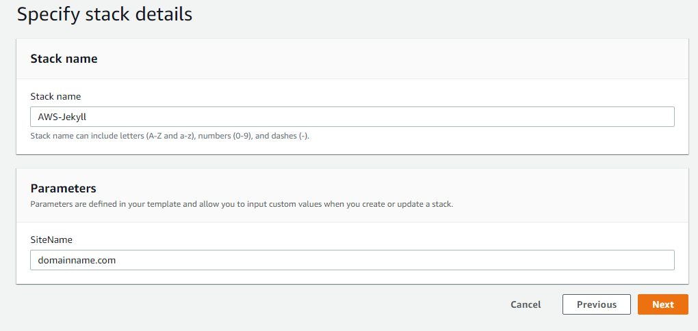

# AWS-Jekyll
(readme.md is WIP) SAM{instalacja, wymagania}

## About
AWS-Jekyll is a project that creates an infrastructure to make, host and manage static websites in a quick and easy way without the necessity of installing any software on your device.

## Main components: 
- [Jekyll](https://jekyllrb.com) (version 3.8.3)
- [Amazon Web Services](https://aws.amazon.com)

## Setting up:
To get started, log in to your aws account, make sure you are accessing the right region and go to the CloudFormation service. Download *cfTemplate.yaml* from the repository and create a stack using that file as a template. In **Specify stack details** you will be asked to enter stack name and your domain name as a parameter called *SiteName*. Make sure you wrote your DNS correctly (i.e. "yourdomain.com"). 

After the succesfull creation, you can check all the created resources, types and physical IDs in the *resources* tab. The stack also has an output called **WwwURL**. Its value is an endpoint of an S3 bucket that will contain your website (remember that at this point the buckets are still empty). 

Now you can upload your website or use a template ([Kotzmik/AWS-Jekyll/site](https://github.com/Kotzmik/AWS-Jekyll/tree/master/site)). Go again to the *resources* tab of your stack and find a bucket called **StageBucket**. This bucket will contain all unprocessed files (explained below). Access this bucket and upload here all your files or the ones from AWS-Jeckyll/site directory. Now go back to the *outputs* tab of your stack and click on the URL.

The only thing left is connecting your DNS to the S3 bucket through Route 53. If you bought the domain from AWS, your domain was automatically connected to the Hosted Zone. If that is not your case, [this article is for you](https://docs.aws.amazon.com/Route53/latest/DeveloperGuide/MigratingDNS.html). Remember that any changes with the DNS can take alot of time.

## Using it
Before you start creating your own website on this structure, you need to have a basic understanding of the Jekyll gem (considering you already understand HTML, CSS, Markdown, etc.). [This link](https://jekyllrb.com/docs/) contains whole jekyll documentation, which will not only help you make your own website, but also help you better understand what is happening in the back-end. Don't worry about the installation and the command line usage because everything is already installed and the commands are being automatically executed in your Lambda function. 
## How it works:

Here are all the AWS Components that CloudFormation is making. 

**StagingUser** with **StagingUserKeys** is able to manage **StageBucket**. 
This bucket contains all the assets needed to create a static site. 
When something gets added to the bucket, **CreateWWWStageBucketEventPermission** triggers **CreateWWW**. 
This function with **CreateWWWRole** and **CreateWWWRubyLayer9cca5ad8ec** (containing ruby gems such as Jekyll etc.) downloads content from StageBucket, executes Jekyll and outputs finished site to **WWWBucket1**. **WebsiteBucketPolicy** makes the final bucket public for all making the site reachable to everyone. 
**WWWBucket2** is an empty bucket that redirects all the traffic to WWWBucket1. 

The last components are **WWWZone**, **WWWRec1** and **WWWRec2** (Route53 hosted zone and records needed to attach DNS to our site). WWWRec1 attaches WWWBucket1 and WWWRec2 ties WWWBucket2 with the hosted zone. 

Because Jekyll is written in Ruby language, so is **CreateWWW**

The template requires one parameter which is simply your DNS. For example, if the parameter is 'domain.com', all the traffic from domain.com address is connecting directly to WWWBucket1 and address www.domain.com goes through WWWBucket2

{wykonanie krok po kroku}

## Work in progress:
I'm working on a serverless web editor for the site using AWS Lambda, Cognito and API Gateway. Currently, the code can be found [on my other repository](https://github.com/Kotzmik/git2s3test) however, it is not commented properly and additional aws services have to be set up manually in order for the editor to work. When I'm done, I'll merge those two projects into one and update the documentation.

### Files:
**cfTemplate.yaml**- CloudFormation template. The only parameter is domain name (without www).

**ruby.zip**- lambda layers. All ruby gems AWS Lambda needs, to run Jekyll.

**www_function.rb**- lambda function code. Just copy paste it into the lambda console :)

**mod_files.msi**- [NSIS](https://nsis.sourceforge.io/Main_Page) script used to create installation files that deploy AWS CLI, credentials and download-upload scripts. OPTIONAL
